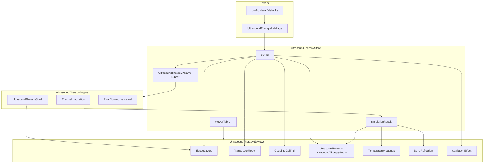

# Auditoria Técnica — Lab de Ultrassom Terapêutico 3D

**Data:** 2026-06-04  
**Escopo:** Fluxo config/store → motor (`ultrasoundTherapyEngine`) → visual 3D (R3F)  
**Status:** Somente leitura — nenhuma alteração funcional nesta etapa.

---

## 1. Pontos de entrada do sistema

### 1.1 Página e inicialização

| Arquivo | Papel |
|---------|-------|
| `src/pages/UltrasoundTherapyLabPage.tsx` | Valida `config_data` (rejeita keys de ultrassom diagnóstico), merge com `defaultUltrasoundTherapyConfig`, monta `UltrasoundTherapyLabV2`, chama `store.clear()` no unmount |
| `src/components/labs/ultrasound-therapy/UltrasoundTherapyLabV2.tsx` | Layout header + 3D + painéis; `initializeLab(config)` no mount; lê `storeConfig` para header mobile |
| `src/stores/ultrasoundTherapyStore.ts` | Fonte única de verdade runtime: `config`, `simulationResult`, `viewerTab`, presets |

### 1.2 Store — ciclo de vida

```
initializeLab(config) / updateConfig(partial) / applyClinicalPreset(id) / reset()
    → normalizeConfig()          // ERA clamp, lock beamProfile se IFU
    → runSimulation()            // monta UltrasoundTherapyParams → engine
    → set({ simulationResult })
```

**Parâmetros enviados ao motor** (`runSimulation`, linhas 138–152):

```typescript
frequency, intensity, era, mode, dutyCycle, duration, coupling, movement,
scenario, customThicknesses, mixedLayer, transducerPosition, tissuePerfusionProfile
```

**Parâmetros do config NÃO enviados ao motor:**

- `transducerType`
- `beamProfile`
- `focusDepth`
- `enabledControls`, `ranges` (só UI / cavitação usa `ranges.intensity`)

**Estado UI-only (store, não persiste em config):**

| Campo | Default | Consumidor |
|-------|---------|------------|
| `viewerTab` | `"beam"` | `UltrasoundTherapy3DViewer` — gating de feixe/térmico/anatomia |
| `activeClinicalPresetId` | `null` | Header / painel |
| `controlPanelCollapsed` | `false` | Legacy |
| `insightsPanelCollapsed` | `true` | Legacy |
| `simulationResult` | `null` | Insights, beam, heatmap, bone reflection |
| `initialAdminConfig` | snapshot init | `reset()` |

### 1.3 Visual 3D — composição da cena

**Orquestrador:** `UltrasoundTherapy3DViewer.tsx`

| Componente | Condição de render | Fonte de dados |
|------------|-------------------|----------------|
| `TissueLayers` | `!mixedLayer.enabled` | `config.scenario`, `customThicknesses`, `viewerTab`, `skinTone` (local) |
| `TissueLayers` + `MixedLayer` | `mixedLayer.enabled && scenario === "custom"` | idem + `mixedLayer.depth/division` |
| `TransducerModel` | sempre | `transducerType`, `era`, `coupling`, `mode`, `intensity`, `dutyCycle`, `scanPosition` |
| `CouplingGelTrail` | sempre | `era`, `transducerType`, `coupling`, `movement`, `scanPosition` |
| `TransducerSkinDragSurface` | `viewerTab === "anatomy"` | escreve `transducerPosition` via `updateConfig` |
| `UltrasoundBeam` | `beam \| thermal` + `simulationResult` | config + **outputs** `effectiveDepth`, `penetrationDepth` |
| `TemperatureHeatmap` | `viewerTab === "thermal"` + `simulationResult` | **outputs** temps + `movement`, `treatedArea`, `era`, `scanPosition` |
| `BoneReflection` | `beam \| thermal` + `simulationResult` | **outputs** + `scenario`, `customThicknesses` |
| `CavitationEffect` | `beam \| thermal` | lê store direto: `intensity`, `mode`, `dutyCycle`, `ranges` |

**Estado local no viewer (não store):**

- `scanTime` — animação de varredura
- `draggingTransducer` — desabilita OrbitControls
- `skinTone` — `pickRandomClinicalSkinTone()` uma vez por mount

**Posição do transdutor no 3D:**

```typescript
scanPosition = movement === "scanning"
  ? { x: transducerPosition.x + sin(scanTime)*0.35, y: transducerPosition.y }
  : transducerPosition
// Mundo: X = position.x * 8, Z = position.y * 3
```

### 1.4 Motor e libs de apoio

| Arquivo | Papel |
|---------|-------|
| `src/simulation/ultrasoundTherapyEngine.ts` | Heurísticas térmicas/acústicas → `UltrasoundTherapyResult` |
| `src/lib/ultrasoundTherapyStack.ts` | STACK 6 cm: pele→gordura→músculo→osso; compartilhado motor + `TissueLayers` |
| `src/lib/ultrasoundTherapyBeam.ts` | Geometria educacional do feixe (N, divergência, foco) — **só 3D** |
| `src/config/therapeuticTransducerDefinitions.ts` | Tipos de transdutor, ERA visual cap, `resolveTransducerFace()` |
| `src/config/ultrasoundTherapyPresets.ts` | Presets clínicos parciais sobre config |
| `src/types/ultrasoundTherapyConfig.ts` | Schema + defaults + perfusion multiplier |

### 1.5 UI analítica (não 3D, consome simulação)

- `UltrasoundTherapyControlPanel.tsx` — sliders/toggles → `updateConfig`
- `UltrasoundTherapyInsightsPanel.tsx` — métricas, risco, recomendações
- `DominantEffect.tsx` — heurística pedagógica (config + simulationResult)
- `ThermalTimeline.tsx` — canvas 2D; usa `config.duration` + temps
- `TransducerMap2D.tsx` — mapa 2D de posição; `transducerType`, `era`, `transducerPosition`

---

## 2. Classificação de parâmetros (config/store)

Legenda: **M** = motor | **V** = visual 3D | **UI** = painéis/gating apenas

### 2.1 Parâmetros terapêuticos principais

| Parâmetro | M | V | UI | Notas |
|-----------|---|---|-----|-------|
| `frequency` | ✅ | ✅ | ✅ | Motor: atenuação, profundidades. Visual: `nearFieldLengthCm`, divergência, cor dos anéis (`UltrasoundBeam`). **Motor ignora frequência em `beamWidth`.** |
| `intensity` | ✅ | ✅ | ✅ | Motor: `effectiveIntensity`, térmico, risco. Visual: opacidade/emissive do feixe, contagem de bolhas (`CavitationEffect`). |
| `era` | ✅ | ✅ | ✅ | Motor: potência, `beamWidth`, área tratada. Visual transdutor/gel: **ERA cap visual 3 cm²**; feixe/heatmap: ERA real. |
| `mode` | ✅ | ✅ | ✅ | Motor: duty efetivo (contínuo=100%). Visual: pulso LED/halo transdutor + ritmo cavitação. |
| `dutyCycle` | ✅ | ✅ | ✅ | Motor: multiplicador energia/térmico. Visual: transdutor + cavitação. |
| `duration` | ✅ | ❌* | ✅ | Motor: evolução térmica, CEM43, risco. *3D usa temps já calculados; `ThermalTimeline` usa duration diretamente. |
| `coupling` | ✅ | ✅ | ✅ | Motor: eficiência 0.95/0.70 + fatores térmicos superfície/alvo. Visual: gel, cores feixe, halo poor. |
| `movement` | ✅ | ✅ | ✅ | Motor: fator térmico 0.4 vs 1.0, área ×2.5. Visual: animação scan, tamanho hotspot, gel trail. |
| `scenario` | ✅ | ✅ | ✅ | Mesma função `buildStackLayers()` no motor e em `TissueLayers`. |
| `customThicknesses` | ✅ | ✅ | ✅ | Stack compartilhado. |
| `mixedLayer` | ✅ | ✅ | ✅ | Motor: periosteal se transdutor sobre lado osso. Visual: `MixedLayer` + `TissueLayers stopAtDepth`. |
| `transducerPosition` | ✅ | ✅ | ✅ | Motor: `isOverBone` em mixed layer. Visual: offset transdutor/feixe/heatmap + drag 3D/2D. |
| `tissuePerfusionProfile` | ✅ | ❌ | ✅ | Motor: `getPerfusionProfileMultiplier()` 0.55 / 1.0 / 1.45. Sem efeito 3D dedicado. |
| `transducerType` | ❌ | ✅ | ✅ | Visual: geometria transdutor, gel, escala lateral feixe. Store normaliza `beamProfile` se IFU. |
| `beamProfile` | ❌ | ✅ | ✅ | Visual: envelope planar vs focalizado (`UltrasoundBeam`). |
| `focusDepth` | ❌ | ✅ | ✅ | Visual: anel zona focal. Motor não modela foco acústico. |
| `enabledControls` | ❌ | ❌ | ✅ | Visibilidade de controles aluno |
| `ranges` | ❌ | △ | ✅ | △ `CavitationEffect` usa `ranges.intensity` para normalizar bolhas |

### 2.2 Outputs do motor (`simulationResult`) — consumo

| Campo | Motor gera | Visual 3D | UI Insights |
|-------|------------|-----------|-------------|
| `effectiveDepth`, `penetrationDepth` | ✅ | `UltrasoundBeam` (maxDepth, anel cyan) | ✅ |
| `surfaceTemp`, `targetTemp`, `maxTemp`, `maxTempDepth` | ✅ | `TemperatureHeatmap` | ✅ |
| `treatedArea` | ✅ | `TemperatureHeatmap` (halo scanning) | ✅ |
| `boneReflection`, `periostealRisk` | ✅ | `BoneReflection` | ✅ |
| `beamWidth` | ✅ | ❌ (feixe 3D usa `ultrasoundTherapyBeam.ts`) | ✅ |
| `powerW`, `energyJ`, `doseJcm2`, `cumulativeDose`, `thermalDose` | ✅ | ❌ | ✅ |
| `risk`, `riskFactors` | ✅ | ❌ | ✅ |

---

## 3. Desacoplamento detalhado (parâmetros solicitados)

### 3.1 `transducerType`

| Camada | Comportamento |
|--------|---------------|
| **Motor** | Não recebe. Potência e geometria de feixe no engine dependem só de `era` (circular equivalente). |
| **Store** | `normalizeConfig`: IFU força `beamProfile = focused`. `updateConfig(transducerType)`: aplica `configDefaultsForTransducerType()` (beamProfile, focusDepth, clamp ERA). |
| **Visual** | `TransducerModel`, `CouplingGelTrail`, `TransducerMap2D` via `resolveTransducerFace()`. `UltrasoundBeam`: `beamLateralScale`, labels, near-field scale retangular. |
| **Desalinhamento** | Retangular/IFU alteram forma do feixe 3D e cabeçote, mas **não alteram** atenuação térmica além do que `era` já captura como pistão circular. |

### 3.2 `beamProfile`

| Camada | Comportamento |
|--------|---------------|
| **Motor** | Ignorado. Profundidade efetiva = 50% intensidade com atenuação exponencial plana. |
| **Visual** | `UltrasoundBeam`: perfil lathe focused (cintura + anel magenta) vs planar (anel near-field). |
| **Desalinhamento** | **Crítico:** preset IFU + `beamProfile: focused` muda feixe 3D, mas **não** concentra energia no motor na `focusDepth`. |

### 3.3 `focusDepth`

| Camada | Comportamento |
|--------|---------------|
| **Motor** | Ignorado. |
| **Visual** | Posição do anel “Zona focal” e geometria `beamRadiusAtDepth` em `ultrasoundTherapyBeam.ts`. |
| **Desalinhamento** | Label 3D indica foco que **não existe** no cálculo de `maxTempDepth` / `targetTemp`. |

### 3.4 `era`

| Camada | Comportamento |
|--------|---------------|
| **Motor** | `powerW = I×ERA`, `transducerRadius = √(ERA/π)`, `beamWidth`, `treatedArea`. |
| **Visual transdutor/gel** | `visualEraAreaCm2()` cap **3.0 cm²** proporcional ao slider (`ERA_VISUAL_CAP_CM2`). Face 3D não cresce linearmente com ERA alta. |
| **Visual feixe/heatmap** | `faceRadiusFromEra(era)` — **ERA real**, sem cap. |
| **Desalinhamento** | Com ERA=6.5, cabeçote 3D ≈ cap 3 cm² mas feixe/heatmap ≈ 6.5 cm²; motor usa 6.5 cm². **Três escalas distintas** para a mesma knob. |

### 3.5 `frequency`

| Camada | Comportamento |
|--------|---------------|
| **Motor** | `frequencyFactor` na atenuação; afeta `penetrationDepth`, `effectiveDepth`, térmico, reflexão óssea. Comentário explícito: **`beamWidth` independente de frequência**. |
| **Visual** | `nearFieldLengthCm = D²/(4λ)`, `farFieldHalfAngleRad`, `relativeBeamIntensity` — **usa λ(f)**. |
| **Desalinhamento** | **Crítico:** feixe 3D estreita/alarga com MHz; motor mantém `beamWidth` só função de ERA + profundidade efetiva. Anel “prof. efetiva” vem do motor; contorno do envelope vem de geometria acústica 3D — podem divergir visualmente. |

### 3.6 `intensity`

| Camada | Comportamento |
|--------|---------------|
| **Motor** | Escala linear após acoplamento; driver principal do térmico e risco. |
| **Visual** | Opacidade/emissive do feixe (`intensity/2.5`). Cavitação: contagem de bolhas ∝ intensidade — **puramente ilustrativa**, sem output `cavitationRisk` no motor. |
| **Desalinhamento** | Cavitação aparece em abas beam/thermal sem threshold físico no engine. |

### 3.7 `mode` + `dutyCycle`

| Camada | Comportamento |
|--------|---------------|
| **Motor** | `effectiveDuty = continuous ? 1 : dutyCycle/100`; afeta energia e aquecimento. |
| **Visual** | Transdutor: LED/halo sync duty. Cavitação: `getPulseState(mode, dutyCycle)`. Feixe: pulso de opacidade contínuo (não sync duty). |
| **Desalinhamento** | Pulsação visual do feixe não segue duty cycle; transdutor/cavitação sim. |

### 3.8 `coupling`

| Camada | Comportamento |
|--------|---------------|
| **Motor** | `couplingEfficiency` 0.95/0.70; superfície poor ×1.4 calor; alvo poor ×0.85. |
| **Visual** | Gel good vs poor (transdutor + trail); feixe âmbar + halo se poor; opacidade ×0.65. |
| **Desalinhamento** | Coerente qualitativamente; magnitudes não calibradas entre cor do feixe e delta térmico numérico. |

### 3.9 `movement`

| Camada | Comportamento |
|--------|---------------|
| **Motor** | Fator térmico 0.4 (scan) vs 1.0 (parado); `treatedArea × 2.5`. |
| **Visual** | Oscilação `sin(scanTime)*0.35` em X; heatmap hotspot ×1.5 e halo por `treatedArea`; gel trail deforma. |
| **Desalinhamento** | Animação de scan é decorativa (amplitude fixa 0.35); não usa `simulationResult.treatedArea` para path. |

### 3.10 `scenario` + espessuras

| Camada | Comportamento |
|--------|---------------|
| **Motor** | `buildStackLayers` → atenuação/térmico/reflexão. |
| **Visual** | `TissueLayers` mesma stack + geometria orgânica. |
| **Desalinhamento** | **Alinhado** na anatomia. Mixed layer: motor usa posição X; visual renderiza plano lateral — coerente se import OK. |

### 3.11 `tissuePerfusionProfile`

| Camada | Comportamento |
|--------|---------------|
| **Motor** | Multiplicador perfusão 0.55 / 1.0 / 1.45; afeta dissipação e risco contextual. |
| **Visual** | Nenhum overlay (fluxo sanguíneo, cor da pele, etc.). |
| **Desalinhamento** | Parâmetro pedagógico “invisível” no 3D. |

---

## 4. Matriz resumida — somente M / somente V / ambos

### Somente motor (ou UI analítica, sem representação 3D direta)

| Parâmetro / output | Observação |
|--------------------|------------|
| `duration` | Afeta temps via simulação; 3D mostra resultado, não anima tempo |
| `tissuePerfusionProfile` | Sem feedback visual |
| `transducerType` | Não no motor |
| `beamProfile`, `focusDepth` | Não no motor |
| `powerW`, `energyJ`, `doseJcm2`, `cumulativeDose`, `thermalDose`, `risk` | Só painéis |
| `beamWidth` (output motor) | Insights sim; feixe 3D recalcula por outra lib |

### Somente visual 3D (não afeta motor)

| Elemento | Observação |
|----------|------------|
| `viewerTab` | Gating de camadas |
| `skinTone` (session random) | Texturas tecido |
| `CavitationEffect` | Ilustrativo; não altera `simulationResult` |
| Pulso contínuo opacidade feixe | `useFrame` sin — independente de duty |
| `Environment`, fog, grid, iluminação | Estética |
| ERA visual cap no transdutor | `visualEraAreaCm2` ≠ ERA motor |

### Ambos (motor + visual)

| Parâmetro | Acoplamento |
|-----------|-------------|
| `frequency` | **Parcial** — atenuação M vs geometria feixe V divergem em `beamWidth` |
| `intensity` | Qualitativo alinhado; cavitação V extra |
| `era` | **Parcial** — cap visual transdutor vs ERA real feixe/motor |
| `mode`, `dutyCycle` | Alinhados no duty efetivo; pulso feixe não |
| `coupling` | Qualitativo alinhado |
| `movement` | Alinhado no térmico; path scan decorativo |
| `scenario`, `customThicknesses` | **Alinhado** (mesma stack) |
| `mixedLayer`, `transducerPosition` | Alinhado conceitualmente |
| `effectiveDepth`, `penetrationDepth` | Motor → anéis/labels feixe |
| Temperaturas, `treatedArea`, `boneReflection`, `periostealRisk` | Motor → heatmap/bone |

---

## 5. Desalinhamentos críticos (prioridade para futuras etapas)

| # | Desalinhamento | Evidência no código |
|---|----------------|---------------------|
| 1 | **Geometria do feixe: motor vs 3D** | Engine L291–316: beamWidth sem λ. `ultrasoundTherapyBeam.ts`: N≈D²/4λ, divergência ∝ λ/D. |
| 2 | **Perfil focalizado só visual** | `beamProfile`/`focusDepth` ausentes em `UltrasoundTherapyParams`. |
| 3 | **ERA tripla escala** | `visualEraAreaCm2` cap 3 cm² (`TransducerModel`); `faceRadiusFromEra(era)` no feixe; `√(era/π)` no motor. |
| 4 | **`transducerType` invisible ao motor** | Retangular/IFU não mudam condutividade/atenuação lateral. |
| 5 | **Cavitação decorativa** | `CavitationEffect` lê `intensity` do store; engine não expõe métrica de cavitação. |
| 6 | **Perfusion invisible** | `tissuePerfusionProfile` altera temps sem cue visual. |
| 7 | **Duty vs pulso do feixe** | `UltrasoundBeam` pulseRef usa sin contínuo; não `mode`/`dutyCycle`. |
| 8 | **`MixedLayer` sem import** | `UltrasoundTherapy3DViewer.tsx` usa `<MixedLayer>` (L186) **sem** `import { MixedLayer } from './MixedLayer'`. Cenário custom + mixed layer provavelmente quebra em runtime. |

---

## 6. Fluxograma de dados



---

## 7. Referência rápida de arquivos inspecionados

| Arquivo | Linhas-chave / responsabilidade |
|---------|--------------------------------|
| `UltrasoundTherapyLabPage.tsx` | Normalização config L24–102 |
| `UltrasoundTherapyLabV2.tsx` | `initializeLab` L44–54; monta 3D viewer |
| `UltrasoundTherapy3DViewer.tsx` | Composição cena L166–256; scan L43–63 |
| `ultrasoundTherapyStore.ts` | `runSimulation` L136–156; params omitidos |
| `ultrasoundTherapyEngine.ts` | Params L237–247; beamWidth L291–316; bone L399–437 |
| `ultrasoundTherapyBeam.ts` | Geometria acústica educacional |
| `ultrasoundTherapyStack.ts` | Presets espessura; `TOTAL_BLOCK_DEPTH = 6` |
| `therapeuticTransducerDefinitions.ts` | `ERA_VISUAL_CAP_CM2`, `resolveTransducerFace` |
| `ultrasoundTherapyConfig.ts` | Schema completo + defaults L144–207 |
| `UltrasoundBeam.tsx` | Props L28–39; usa sim outputs + config visual-only |
| `TemperatureHeatmap.tsx` | Props simulation temps + movement + era |
| `CavitationEffect.tsx` | Store getState L87–88 |
| `BoneReflection.tsx` | `boneReflection`, `getBoneStartDepth` |
| `TissueLayers.tsx` | `buildStackLayers(scenario, customThicknesses)` |
| `TransducerModel.tsx` | Props L42–49; `resolveTransducerFace` |

---

## 8. Critérios de aceite desta auditoria

| Critério | Status |
|----------|--------|
| Projeto compila sem alterações | ✅ `npm run build` OK |
| Documento lista entradas motor / visual / store | ✅ Seções 1–2 |
| Desalinhamentos motor ↔ 3D identificados | ✅ Seções 3–5 |
| Nenhuma mudança funcional aplicada | ✅ Apenas este `.md` |

---

## 9. Próximos passos sugeridos (fora desta etapa)

1. Corrigir import de `MixedLayer` em `UltrasoundTherapy3DViewer.tsx`.
2. Decidir política única de ERA (visual = física vs cap pedagógico documentado na UI).
3. Unificar ou documentar explicitamente feixe motor vs `ultrasoundTherapyBeam.ts`.
4. Propagar `beamProfile`/`focusDepth` ao motor **ou** rotular feixe 3D como “modelo educacional”.
5. Vincular cavitação a threshold derivado de `intensity` + `frequency` no engine, ou badge “ilustrativo”.
